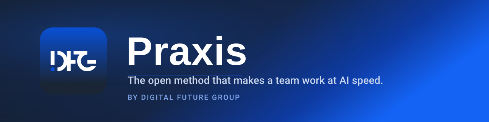

# Digital Future Group

Digital Future Group (DFG) is an engineering partner for regulated industries — banking, insurance, healthcare. We build and modernize software as a system, and we price for the result, not for hours logged.

## Praxis — the open method that makes a team work at AI speed, not just a developer

Individual AI tools already made a single developer faster. **Praxis** is what makes an entire team work that way — systematically, not one person at a time — and it does it in the open: the method is public, so you can see how a result actually gets built instead of taking anyone's word for it.

**What it does.** Agents write code around the clock. Engineers organize that work: they set the task and the requirements, hold the shared contract between roles, configure the environment, then check and accept what comes back. Every result runs through a verification cycle — a "done" verdict isn't final the moment it's given; it gets re-checked at every next step. Every artifact carries a provenance record — version, author, reason, history — so it can be reconstructed from source, not just handed over as a finished file. This is not vibe-coding.

The result: the same scope of work, delivered by a materially smaller team, faster, without a drop in quality. On one engagement built this way, Trustmark moved 22 of 24 applications from IBM AIX to Azure in under five months, within the original scope and budget.

**Get it.** Praxis is open — read the method, run it, check it yourself before you take any of the above on faith.

## Repositories

| Repository | What it provides |
|---|---|
| [praxis-ba](https://github.com/dfg-inc/praxis-ba) | Business Analyst harness: product intent, requirements and work-package handoff |
| [praxis-architect](https://github.com/dfg-inc/praxis-architect) | Architect harness: technical decisions, contracts and Developer handoff |
| [praxis-developer](https://github.com/dfg-inc/praxis-developer) | Developer harness: implementation, verification and evidence |
| [praxis-quality](https://github.com/dfg-inc/praxis-quality) | Quality Harness: review a work result and its evidence |
| [praxis-core](https://github.com/dfg-inc/praxis-core) | Shared contracts and libraries |
| [praxis-runtime](https://github.com/dfg-inc/praxis-runtime) | Local Runtime and role workflow tools |

Start with the [website](https://praxis.dfuture.co) and [role guides](https://praxis.dfuture.co/docs/plugins/). Each teammate can use their own harness; shared artifacts connect their work across the delivery lifecycle.

Quality Harness is public source. The separate **Quality Platform** is private and is being built for quality history across multiple projects. [Talk to us about the Platform](https://praxis.dfuture.co/enterprise?interest=quality-platform#contact).

## Built for regulated industries

Banking, insurance, and healthcare hold vendors to audited standards, not promises. These are the ones we build and certify to.

## Get in touch

Have a result you need to move to predictable delivery? That's a conversation, not a purchase.

- **Email:** [business@dfuture.co](mailto:business@dfuture.co)
- **Web:** [dfuture.co](https://dfuture.co)

---

**Digital Future Group** · [dfuture.co](https://dfuture.co) · Praxis by DFG
